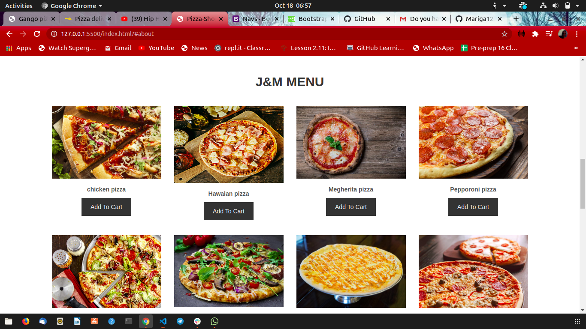

# J&M PIZZA SHOP 

## DESIGNER
 MARIGA JOHN

## Description
* An pizza shop for customers to make their at the comfort of their homes,parties offices or any place of the country and get their orders delivered quick.
* This website was started to ensure safety of our customers during this period and allows them to be safe with their families.

## Expectation of the Page
* A form for home delivery address.
* Affordable transaction fee.
* Feedback form for rating our services.
* A customers transacts digitally when making payments.

### Interface with the page
 
* Visit our page and enjoy your favourite pizza at affordable price.

### To run my page on your browser,
* Download the zip codes from my git account.
* Extract the zip file to your folder directory documents or desktop.
* Open the folder saved using Visual studio or Atom.
* To render the page on your browser,Go live with your server.
* Edit codes and push it to github

### Known Bugs
* Researching on advancement of add to cart icon and checkout.
* Customer care landline for customers to get immediate feedback.
* More guideline of how customers interact with pizza shop.
* Advancing on a more secure way of handling customers transaction to ensure their trust is more earned.

## Technologies Used
* HTML
* CSS
* Bootstrap
* javascript

### Support and contact details
* email @ johnmariga8@gmail.com
* 0742249975
* fb @zellyjones
* instagram @ Mariga john

### License
licensed under [MIT license](LICENSE)